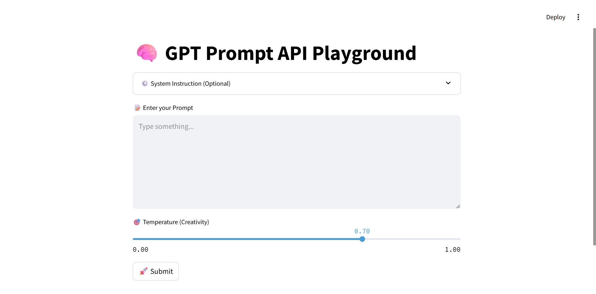

# 🧠 GPT Prompt API Playground

This is a lightweight demo application that allows users to interact with OpenAI's GPT model via a custom prompt interface. The app is built using **Streamlit** for the frontend and **OpenAI API** for backend interaction.

<br/>

## 🚀 Features

- Submit any prompt and receive GPT-4 responses in real-time
- Optional system prompt customization
- Adjustable temperature (creativity level)
- Clean, intuitive UI with emoji-enhanced inputs

<br/>

## 🛠 Tech Stack

- **Frontend**: Streamlit
- **Backend**: Python, OpenAI GPT-4 API
- **Deployment**: Local or Streamlit Cloud

<br/>

## 📸 Screenshot



<br/>

## 🔧 How to Run Locally

1. Clone this repo:
```bash
git clone https://github.com/luoboluoboHu61/prompt-api-playground.git
cd prompt-api-playground

Install dependencies:
pip install -r requirements.txt

Set your OpenAI API key:
set OPENAI_API_KEY=your_api_key_here   # Windows
# or
export OPENAI_API_KEY=your_api_key_here  # Mac/Linux

Launch the app:
streamlit run app.py

🌍 Use Case
This project was built as part of a remote engineering internship simulation, focusing on rapid prototyping of user-facing AI tools. It demonstrates frontend/backend integration, clean product thinking, and real-world API usage.


